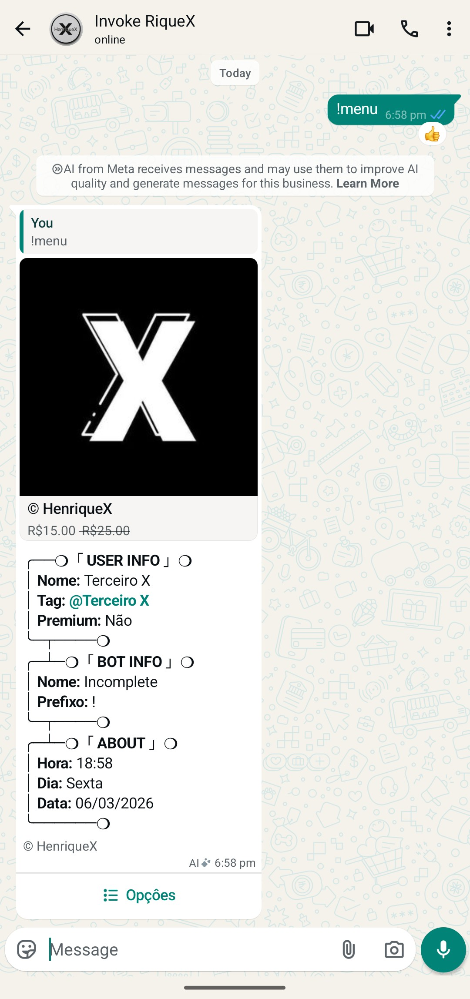

# 🚀 Incomplete

<p align="center">
  
</p>©

<h1 align="center">🤖 HenriqueX Flow</h1>

<p align="center">
  
  
</p>

<p align="center">
  
</p>

---

## 📚 About The Project

**Incomplete** It's A WhatsApp Bot Built With **Node.js** And **TypeScript**, Using The Library **Baileys**. 
It Offers A Modular System With Support For **Dynamic Plugins**, **Interactive Menus**, **AI Messaging**, And Much More.

---

## ⚙️ Funções Implementadas

| Function               | Status |
|----------------------|:------:|
| Send Text         | ✅ OK  |
| Reply To Message   | ✅ OK  |
| Tag Número        | ✅ OK  |
| Send AI Tag        | ✅ OK  |
| Send Buttons        | ✅ OK  |
| Send Stickers    | ✅ OK  |
| Send Videos        | ✅ OK  |

---

## 💬 Main Commands

| Command | Description |
|----------|------------|
| **menu geral** | Commands For Any User |
| **menu owner** | Commands For The Bot Owner  |
| **menu group** | Commands For Groups/Admins  |

---

## 🛠️ Standard Installation

```bash
# Clone The Bot Repository
git clone https://github.com/HenriqueX-Flow/Incomplete.git

# Access The Bot Directory
cd Incomplete

# Install The Dependencies
npm i

# Compile The Project
npm run build

# Start The Bot
npm start
