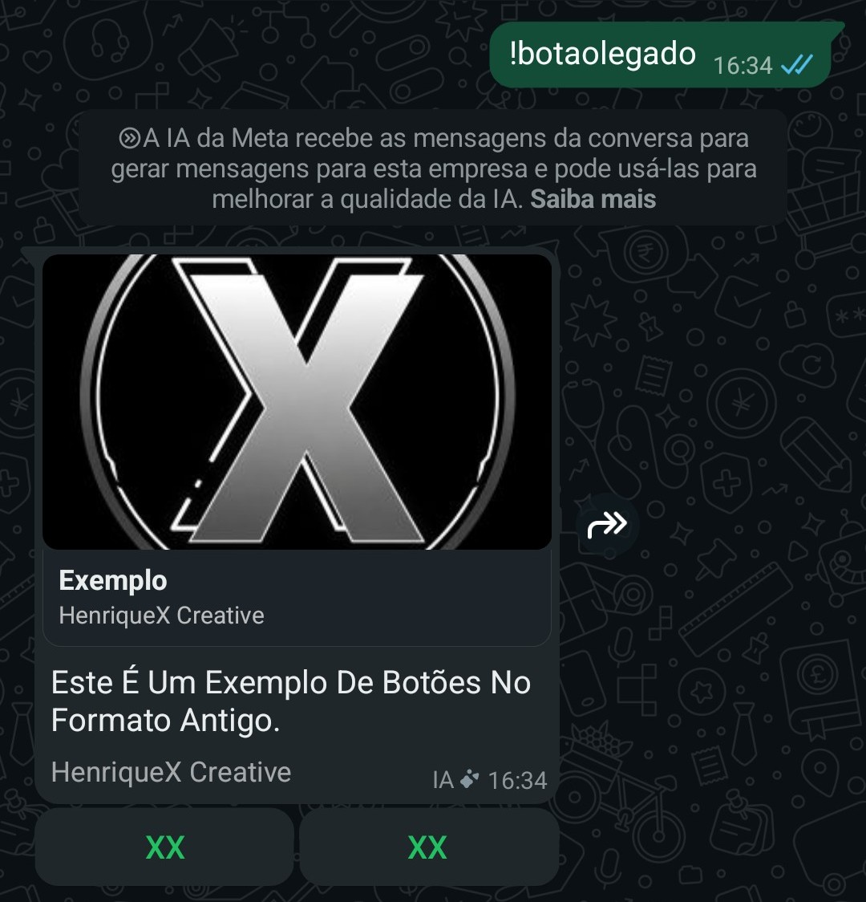

# 🤖 Incomplete — Bot De WhatsApp Educacional

<p align="center">
  
  
  
  
</p>

<p align="center">
  
</p>

> [!IMPORTANT]
> **Versão Atual: JavaScript Puro (Beta).** Esta É A Nova Versão, Reescrita
> **100% Em JavaScript** (`"type": "module"`, Sem TypeScript), Com Arquitetura
> Por Plugins, Flags Estilo Terminal E Hot-Reload De Comandos. Aplicativo
> Feito **Do Zero Pra Ser Simples De Entender** — Inclusive Pra Quem Não Sabe
> Programar.

Um **Bot De WhatsApp Educacional** Feito Com [Baileys](https://github.com/WhiskeySockets/Baileys),
Pensado Pra Estudar JavaScript E Rodar Até No Celular (Termux), Em Qualquer
PC Ou Num Servidor (VPS). Cada Comando É Um Plugin Independente Em
`src/plugins/<categoria>/<nome>.js` — Auto-Descoberto, Sem Precisar Registrar
Nada Em Lugar Nenhum.

---

## ⚠️ Aviso Importante — Risco De Banimento

> [!CAUTION]
> **Esse Bot NÃO Usa A API Oficial Do WhatsApp (WhatsApp Business API/Cloud API).**
> Ele Se Conecta Através De Engenharia Reversa Do Protocolo Do WhatsApp Web
> (Via [Baileys](https://github.com/WhiskeySockets/Baileys)), Simulando Um
> Cliente Comum — Não É Um Método Suportado, Oficial Ou Endossado Pela Meta.
>
> A Partir Do Momento Em Que Você Faz O Pareamento (Escaneando O QR Code Ou
> Usando O Código De Pareamento), **A Responsabilidade Pelo Uso Do Número
> Passa A Ser Inteiramente Sua.** Isso Inclui, Mas Não Se Limita A:
>
> - Risco De Banimento Temporário Ou Permanente Do Número Pelo WhatsApp,
>   A Qualquer Momento E Sem Aviso Prévio — Independente De Quão "Correto"
>   O Uso Pareça Ser Da Sua Parte;
> - Qualquer Consequência De Automações, Comandos, Ou Mensagens Enviadas
>   Pelo Bot Em Nome Desse Número;
> - Conformidade Com Os [Termos De Serviço Do WhatsApp](https://www.whatsapp.com/legal/terms-of-service)
>   No Seu País/Região.
>
> **Recomendação Forte:** Nunca Use Seu Número Pessoal Principal Pra Rodar
> O Bot. Use Um Número Secundário/Reserva, De Preferência Um Que Você Possa
> Perder Sem Problema. Os Mantenedores Desse Repositório Não Se
> Responsabilizam Por Banimentos, Perda De Acesso À Conta, Ou Qualquer Outro
> Dano Decorrente Do Uso Do Bot.

---

## ✨ Funcionalidades

| Funcionalidade | Descrição |
|---|---|
| 🧩 **Plugins Auto-Descobertos** | Cada Comando É Um Arquivo Em `src/plugins/`. Crie O Arquivo E Ele Já Aparece No Menu |
| 🔄 **Hot-Reload** | Edite Um Plugin E O Bot Recarrega Sozinho, Sem Reiniciar |
| 📋 **Menu Interativo** | 3 Estilos: Documento, Botões Interativos (NativeFlow) E Texto Simples |
| 🎮 **Minigame De Nave** | Jogo HTML Interativo Que Roda Dentro Da Própria Mensagem (Recurso Experimental) |
| 📊 **Sistema De Nível / XP** | Ganhe XP Por Mensagem E Suba De Nível Com Banner Gerado (Canvas Ou Ffmpeg) |
| 💰 **Economia (Nemesis Credits)** | Saldo, Daily, Loja E Compras De Limite/Premium |
| ⭐ **Premium / VIP** | Temporário Ou Permanente, Com Limite Diário Maior E Comandos Exclusivos |
| 🚨 **Antiflood + Ban Progressivo** | Protege O Bot De Spam De Comandos |
| 🔗 **Antilink** | Filtro De Links (WhatsApp/Instagram/YouTube) Com 3 Modos De Ação |
| 👋 **Welcome / Leave** | Mensagens De Entrada/Saída Com Delay Humano E Placeholders |
| 🖼️ **Figurinhas** | Imagem/Vídeo → Webp (Com EXIF), Usando O Ffmpeg Do Sistema |
| 🎵 **Play Áudio / Vídeo** | Busca E Envia Música/Vídeo Do YouTube Via SpiderX API |
| 📦 **Backup Pelo Zap** | Mande O Backup Completo (Ou Só Os Dados) Como `.zip` Pelo WhatsApp |
| 💾 **Banco JSON Simples** | `database/data.json`, Sem Precisa De Banco De Dados Externo |

---

## 📸 Prints — Clique Pra Abrir

> Abaixo Os Prints De Alguns Comandos. Clique No Título De Cada Um Pra
> Expandir E Ver A Imagem.

### !ping — Resposta Rápida

<details>
<summary><strong>!ping — Comando De Teste</strong></summary>

<br>

O Comando Mais Simples Do Bot: Verifica Se Ele Está Online E Respondendo.
A Resposta Vem Em Milissegundos.

```
!ping
```

> Resposta: `Pong`


</details>

### !menu — Menu Interativo (Estilo 2)

<details>
<summary><strong>!menu — Menu Com Botões Interativos</strong></summary>

<br>

Menu Montado **Sozinho** A Partir Dos Plugins Existentes. No Estilo
Interativo (NativeFlow), Cada Categoria Vira Uma Opção De Lista E Tem
Botões De Atalho (Ver Tudo, Ping, Repositório).

```
!menu
```

> Dica: Troque O Estilo Com `!config --style 1|2|3` (Dono).


</details>

### !botaolegado — Botões No Formato Antigo

<details>
<summary><strong>!botaolegado — Exemplo De Botões Legacy</strong></summary>

<br>

Exemplo De Como Enviar Botões No Formato Antigo Do WhatsApp (Com
Imagem, Nome E Botões Personalizados).

```
!botaolegado
```



</details>

---

## 🚀 Instalação

### Requisitos Mínimos

- **Node.js 18+** (Recomendado: **20 LTS** Ou Superior)
- **npm** (Já Vem Junto Com O Node)
- **Git**
- **Ffmpeg** — *Opcional Mas Recomendado* (Ver Nota Abaixo)

> [!NOTE]
> **Por Que O Ffmpeg?** Ele É Um Binário Do Sistema, Não Uma Dependência Do
> Npm. É Usado Por Dois Recursos: O Comando `!s` (Figurinha) E O Fallback
> De Geração Do Card De Nível (`rankCardFfmpeg`). Se Você Não For Usar
> Figurinhas, Pode Deixar De Instalar E O Resto Do Bot Funciona Normal.

---

### 📱 Termux (Android — Celular)

```bash
pkg update -y && pkg upgrade -y
pkg install nodejs-lts git ffmpeg -y
git clone https://github.com/HenriqueX-Flow/Incomplete
cd Incomplete
npm install
npm start
```

> [!TIP]
> **Mantendo O Bot Online No Celular:**
> 1. Rode `termux-wake-lock` Depois De Iniciar A Sessão Do Termux Pra
>    Impedir Que O Celular "Durma" E Corte A Conexão.
> 2. No Android, Ative "Sessões Em Segundo Plano"/"Não Otimizar" Pro Termux
>    Nas Configurações Do Sistema, Senão O Sistema Pode Matar O Processo.
> 3. Se Quiser Que O Bot Continue Rodando Com A Janela Fechada, Use O
>    **PM2** (Ver Seção "Rodar Em Segundo Plano").
>
> **Aviso:** Ficar Com O Termux Aberto E A Tela Acesa **Não** É Necessário
> Nem Recomendado — Isso Esquenta O Celular E Drena A Bateria. Use O PM2
> E O `termux-wake-lock` Em Vez Disso.

---

### 🐧 Linux (Ubuntu / Debian)

```bash
# Instala O Node.js 20 (O Repositório Do Ubuntu Tem Versão Antiga)
curl -fsSL https://deb.nodesource.com/setup_20.x | sudo -E bash -
sudo apt install -y nodejs git ffmpeg

git clone https://github.com/HenriqueX-Flow/Incomplete
cd Incomplete
npm install
npm start
```

### 🐧 Linux (Arch / Manjaro)

```bash
sudo pacman -Syu
sudo pacman -S nodejs npm git ffmpeg

git clone https://github.com/HenriqueX-Flow/Incomplete
cd Incomplete
npm install
npm start
```

### 🪟 Windows (PC)

1. Instale O **Node.js LTS** Em [nodejs.org](https://nodejs.org) (Marque
   "Add To PATH").
2. Instale O **Git** Em [git-scm.com](https://git-scm.com).
3. Instale O **Ffmpeg** (Opcional) No PowerShell:
   ```powershell
   winget install Gyan.FFmpeg
   ```
4. No **PowerShell** Ou **Git Bash**, Rode:
   ```powershell
   git clone https://github.com/HenriqueX-Flow/Incomplete
   cd Incomplete
   npm install
   npm start
   ```

### 🍎 macOS

```bash
# Se Não Tiver O Homebrew: https://brew.sh
brew install node git ffmpeg

git clone https://github.com/HenriqueX-Flow/Incomplete
cd Incomplete
npm install
npm start
```

---

## ▶️ Primeira Execução (Configuração Automática)

No Primeiro `npm start`, Um **Assistente Interativo** (`src/startup.js`)
Pergunta Tudo Antes De Conectar:

1. **Como Conectar?** — `QR CODE` Ou `CÓDIGO DE PAREAMENTO`
   (Recomendado Pra Celular).
2. **Nome Do Bot** — É O Que Aparece Nas Mensagens/Figurinhas.
3. **Número Do Dono** — Com DDI + DDD (Ex: `5511999999999`).
4. **Seu Nome (Dono)**.
5. **Número Que O Bot Vai Usar** (Só No Modo Pareamento).
6. Confirma E O Bot Conecta.

Se Escolheu **Código De Pareamento**, O Terminal Mostra Um Código De 8
Dígitos. Digite Ele Em:

> WhatsApp > **Aparelhos Conectados** > **Conectar Com Número De Telefone**

Tudo Isso É Salvo No `src/config.json`. Nas Próximas Execuções (Com Sessão
Salva Na Pasta `session/`), O Bot Pula Direto O Assistente E Conecta.

---

## 🛡️ Rodar Em Segundo Plano (Recomendado)

### No Termux / Celular

```bash
termux-wake-lock          # Evita Que A Tela "Durma" E Corte A Conexão

# Depois instala o PM2 e roda o bot através dele (sobrevive ao fechamento do app):
npm install -g pm2
npx pm2 start src/index.js --name Incomplete
npx pm2 logs Incomplete   # Ver Os Logs
npx pm2 save             # Salvar Pra Reiniciar Sozinho Pro Termux Subir
```

> [!CAUTION]
> **PM2 No Termux:** O PM2 Sozinho Não Mantém O Bot Rodando Se O Celular
> "Matar" O Termux Em Segundo Plano — No Android Isso É Controlado Pelo
> Sistema (Economia De Bateria/Doze). Você Precisa Dos Dois: `termux-wake-lock`
> **+** Desativar A Otimização De Bateria Pro Termux Nas Configurações Do
> Celular.

### No PC / VPS (Qualquer Sistema)

```bash
npm install -g pm2
pm2 start src/index.js --name Incomplete
pm2 logs Incomplete
pm2 save
pm2 startup            # (Linux/macOS) Reinicia Sozinho Após Reboot
```

> O Comando `!restart` (Dono) Funciona Melhor Quando O Bot Tá Sob O PM2:
> Ele Encerra O Processo E O PM2 Reinicia Automaticamente.

---

## 🎮 Comandos

> Prefixo Padrão: **`!`** (Configurável No `src/config.json` → `prefix`).
> Todo Comando Aceita `-h` / `--help` Pra Mostrar A Ajuda Automática.

### ⚡ Mixers

<details>
<summary><strong>!ping</strong> — Teste Rápido</summary>
<br>
Verifica Se O Bot Está Online E Respondendo. ✅ Print Na Seção "Prints" (Acima).
```
!ping
```
</details>

<details>
<summary><strong>!runtime / !uptime</strong> — Tempo Online</summary>
<br>
Mostra Há Quanto Tempo O Bot Está Ligado.
```
!runtime
```
</details>

<details>
<summary><strong>!menu / !help / !menuall</strong> — Menu De Comandos</summary>
<br>
Menu Montado Automaticamente A Partir Dos Plugins Existentes. `!menuall`
Lista Tudo De Uma Vez. Categorias Novas Aparecem Sozinhas. ✅ Print Na
Seção "Prints" (Acima).
```
!menu
!menuall
```
> Estilo Troca Com `!config --style 1|2|3` (Dono).
</details>

### 👤 Usuário

<details>
<summary><strong>!me / !perfil</strong> — Seu Perfil</summary>
<br>
Mostra Limite, Nível, Saldo, Premium E Status De Banido.
```
!me
```
</details>

<details>
<summary><strong>!level / !rank / !nivel</strong> — Card De Nível</summary>
<br>
Gera Um Banner De Nível Com Sua Foto De Perfil (Canvas, Com Fallback Pra Ffmpeg).
```
!level
```
</details>

### 💰 Economia

<details>
<summary><strong>!saldo / !nc / !carteira</strong> — Ver Saldo</summary>
<br>
Mostra Quanto Você Tem De **Nemesis Credits** (NC).
```
!saldo
```
</details>

<details>
<summary><strong>!daily / !resgatar</strong> — Bônus Diário</summary>
<br>
Resgata Uma Quantia Aleatória De NC, Uma Vez Por Dia.
```
!daily
```
</details>

<details>
<summary><strong>!loja / !shop</strong> — Ver A Loja</summary>
<br>
Lista Os Itens Que Dá Pra Comprar (Pacote De Limite E Pacotes Premium).
```
!loja
```
</details>

<details>
<summary><strong>!comprar / !buy</strong> — Comprar Itens</summary>
<br>
Gasta NC Na Loja. Compra Limite Ou Premium.
```
!comprar limite
!comprar premium 1h
```
</details>

### 🖼️ Conversão

<details>
<summary><strong>!s / !sticker / !figurinha</strong> — Figurinha</summary>
<br>
Marque **Imagem Ou Vídeo Curto** → Vira Figurinha Webp (Com O Nome Do Bot
No EXIF). Também Tem Formato Redondo: `!sticker-round`.
```
!s        (respondendo/marcando uma imagem)
```
> ⚠️ **Precisa Do Ffmpeg Instalado No Sistema.** Sem Ele, O Comando
> Avisa: `ffmpeg não encontrado. No Termux, rode: pkg install ffmpeg -y`.
</details>

### 🎵 Downloader

<details>
<summary><strong>!playaudio / !play</strong> — Áudio Do YouTube</summary>
<br>
Busca E Envia O Áudio (mp3) Da Música Pedida.
```
!playaudio nome da música
```
> ⚠️ Precisa De Um **Token Da SpiderX** Em `config.json` → `spiderx.token`.
> Site: https://api.spiderx.com.br
</details>

<details>
<summary><strong>!playvideo / !pv</strong> — Vídeo Do YouTube</summary>
<br>
Busca E Envia O Vídeo (mp4) Pedido.
```
!playvideo nome do vídeo
```
> ⚠️ Precisa De Um **Token Da SpiderX** (Ver Acima).
</details>

### 👑 Administração De Grupo

<details>
<summary><strong>!add / !kick / !promote / !demote</strong> — Gerenciar Membros</summary>
<br>
Adiciona, Remove, Promove Ou Rebaixa Um Membro. Funciona Mencionando,
Respondendo Ou Passando O Número.
```
!kick @alguém
!promote @alguém
```
> Requer: Grupo + Você Admin + Bot Admin.
</details>

<details>
<summary><strong>!grupo / !group</strong> — Configurar O Grupo</summary>
<br>
Altera Nome, Descrição Ou Abre/Fecha O Grupo (Comandos De Admin).
```
!grupo -name Novo Nome
!grupo -desc Nova Descrição
!grupo -set open   (ou close)
```
</details>

<details>
<summary><strong>!antilink</strong> — Filtrar Links</summary>
<br>
Detecta E Age Sobre Links No Grupo. Tipos: `-chat` (WhatsApp), `-insta`,
`-yt`. Modos (Do Mais Leve Ao Mais Pesado): `--delete` (só apaga),
`--remove` (apaga e remove), `--protect` (protege o grupo durante a ação).
```
!antilink -chat --delete on
!antilink -yt --remove on
!antilink                  (ver status de todos os tipos)
```
> Admins Do Grupo Nunca São Filtrados. Penalidade Extra No Bot
> (Tirar Limite/Remover Premium/Banir) É Opcional:
> `config.json` → `antilinkPenalty.enabled`.
</details>

<details>
<summary><strong>!welcome / !boasvindas</strong> — Boas-Vindas Em Grupo</summary>
<br>
Aviso Automático Quando Alguém Entra No Grupo. **Desligado Por Padrão.**
```
!welcome -on / -off / -reset
!welcome -msg Bem-Vindo(a) @user Ao #grupo!
```
Placeholders: `@user` (marca), `#user` (nome), `#grupo` (nome do grupo).

> [!CAUTION]
> **Welcome/Leave Em Grupo Grande É Um Padrão Que O WhatsApp Fácilmente
> Reconhece Como "Bot".** O Bot Já Mitiga Com Delay Humano (3–12s,
> Simulando "Digitando...") E Um Limite De Lote (Se Muita Gente Entra/Sai
> De Uma Vez, Não Manda Nada). Mesmo Assim, Em Grupos Centenas De Membros,
> Use Consciente Do Risco De Banimento — Veja O Aviso No Topo.
</details>

<details>
<summary><strong>!leave / !saida</strong> — Aviso De Saída</summary>
<br>
Aviso Automático Quando Alguém Sai Do Grupo. **Desligado Por Padrão.**
```
!leave -on / -off / -reset
!leave -msg #user Saiu Do #grupo. 👋
```
> Dica: **Leave** Prefira `#user` Em Vez De `@user` — Mencionar Quem Já
> Saiu Do Grupo Comumente Não Funciona.
</details>

### 🔐 Dono (Owner)

<details>
<summary><strong>!give / !addnc / !addlimit</strong> — Ajustar Saldo/Limite</summary>
<br>
Adiciona NC Ou Limite Pra Um Usuário. Suporta Flags Estilo Terminal.
```
!give -nc --user @alguém --amount 100
!give -limit --user @alguém --amount 10
!addnc @alguém 100      (atalho)
```
</details>

<details>
<summary><strong>!ban / !unban / !desban</strong> — Banir Do Bot</summary>
<br>
Bloqueia Ou Desbloqueia Um Usuário De Usar O Bot.
```
!ban @alguém
!unban @alguém
```
</details>

<details>
<summary><strong>!premium / !vip</strong> — Gerenciar Premium</summary>
<br>
Dá Ou Remove Premium (Temporário Ou Permanente).
```
!premium -add --user @alguém --t 5m
!premium -add --user @alguém        (permanente)
!premium -delete --user @alguém
```
> Tempo Aceita `s`/`m`/`h`/`d` (Ex: `5m`, `1h`, `7d`).
</details>

<details>
<summary><strong>!config / !set / !cfg</strong> — Configurações Em Tempo Real</summary>
<br>
Muda Estilo Do Menu, Leitura Automática, "Digitando..." E Modo
Público/Privado — Sem Reiniciar O Bot.
```
!config --style 2
!config --autoread on
!config --autotyping off
!config --status private
```
</details>

<details>
<summary><strong>!backup</strong> — Backup Pelo WhatsApp</summary>
<br>
Manda Um `.zip` Do Bot Direto No Chat. `--full` Zipa O Bot Inteiro;
`--database` Só Config, Banco E Sessão.
```
!backup --full
!backup --database
```
</details>

<details>
<summary><strong>!restart</strong> — Reiniciar O Bot</summary>
<br>
Reinicia O Bot. Sob PM2 Ele Sobe Sozinho; Com `node` Puro Ele Só Encerra.
```
!restart
```
</details>

<details>
<summary><strong>!raw</strong> — Inspecionar Mensagem</summary>
<br>
Mostra O JSON Cru (Baileys) De Uma Mensagem Respondida. Com `--file`,
Envia Como Arquivo `.json`.
```
!raw            (respondendo a uma mensagem)
!raw --file
```
</details>

<details>
<summary><strong>!getplugin / !plugincode</strong> — Pegar Código De Um Plugin</summary>
<br>
Manda O Código Fonte (.js) De Qualquer Plugin — Útil Pra Estudar.
```
!getplugin menu --code
!getplugin ping --file
```
</details>

<details>
<summary><strong>!exec / !term / !terminal</strong> — Terminal No Chat</summary>
<br>
Executa Comandos Do Sistema No Chat. ⚠️ **Perigoso** — Comandos Destrutivos
(`rm`, `mkfs`, `shutdown`, `npm`, `git push --force`, ...) São Bloqueados.
```
!exec ls -la
```
</details>

<details>
<summary><strong>!eval</strong> — Rodar JavaScript</summary>
<br>
Avalia Código JavaScript No Contexto Do Bot (Vê `client`, `db`, `config`...).
Só Pra Quem Sabe O Que Está Fazendo.
```
!eval 1 + 1
```
</details>

### 🎮 Jogo

<details>
<summary><strong>!nave / !espaconave</strong> — Minigame De Nave</summary>
<br>
Jogo HTML Interativo Que Roda **Dentro Da Própria Mensagem** (Canvas +
Botões). Desvie Da Chuva De Obstáculos.
```
!nave
```

> [!WARNING]
> **Recurso Instável (Teste):** Usa O Recurso Interno `sendRichHtml` Do
> WhatsApp — Pode Não Funcionar Em Algumas Versões Do App Ou Plataformas,
> E Pode Parar De Funcionar A Qualquer Momento.
</details>

### 🧪 Exemplos (Pra Estudar/Copiar)

<details>
<summary><strong>!botoes / !botaolegado / !baixar / !vipzone / !arearestrita / !exemploflags</strong></summary>
<br>

Exemplos Prontos Que Documentam Os Recursos Do Bot — **Feitos Pra Você
Copiar E Criar Seus Próprios Comandos**:

```
!botoes          → Botões Interativos (NativeFlow) ✅ Print Na Seção "Prints"
!botaolegado     → Botões No Formato Antigo          ✅ Print Na Seção "Prints"
!baixar          → Exemplo De Download De Mídia
!vipzone         → Exemplo De Comando Exclusivo Premium
!arearestrita    → Exemplo De Comando Com Nível Mínimo (5)
!exemploflags    → Exemplo De Comando Com Flags Estilo Terminal
```

</details>

---

## 🧩 Criar Um Comando (Plugin) Novo

Crie Um Arquivo Em `src/plugins/<categoria>/<nome>.js` E **pronto** — O
Bot Já Descobre Sozinho E Ele Aparece No `!menu`. Copie De
`src/plugins/example/flags.js`:

```js
/** @type {import("../../handler.js").PluginRun} */
export const run = {
    usage: ["meunome", "alias"],   // Nomes Do Comando (O Índice 0 É O Principal)
    use: "<mensagem>",             // (Opcional) Exemplo De Uso Pro Help
    help: [                        // (Opcional) Documenta Cada Flag Pra -h/--help
        "-fla <valor>   Explica A Flag",
    ],
    category: "example",           // Categoria = Pasta Onde O Plugin Está
    run: async (m, { client, db, config, args, Utils }) => {
        return m.reply("Comando Funcionando")
    }
}
```

Restrições Opcionais No `run` (Todas Opcionais):

| Flag | Efeito |
|---|---|
| `owner: true` | Só O Dono Do Bot Pode Usar |
| `admin: true` | Só Admins Do Grupo (Exige `group: true`) |
| `botAdmin: true` | O Bot Precisa Ser Admin Do Grupo |
| `group: true` | Só Funciona Em Grupos |
| `premium: true` | Só Quem É Premium (Ou O Dono) Pode Usar |
| `needLevel: 5` | Precisa De Nível Mínimo No Sistema De XP |
| `hidden: true` | Não Aparece No `!menu` |

> 📝 **Pra Quem Tá Estudando:** Rode `!backup --full`, Mande O `.zip` Pro
> Chat E O Use Como Referência. Ou Veja O `.github/Copilot-Instructions.md`
> E Oriente A Sua IA A Criar Um Plugin Seguindo As Regras Do Repositório.

---

## ⚙️ Sistema De Flags (Estilo Terminal)

Vários Comandos (Dono/Admin) Aceitam Argumentos Estilo `git commit -m`.
A Regra É Sempre A Mesma (Implementada Uma Vez Em `src/core/flags.js` →
`parseFlags`):

| Pedaço | Como Escreve | Pra Que Serve | Obrigatório? |
|---|---|---|---|
| **Ação** | `-nome` (1 traço) | Escolhe O "Modo" (Ex: `-add`, `-delete`) | Só Se O Comando Tiver Mais De Um Modo |
| **Flag** | `--nome valor` (2 traços) | Dado Nomeado (Ex: `--user @alguém`, `--t 5m`) | Depende Do Comando |
| **Posicional** | Só O Valor, Sem Traço | Atalho Pro `--flag`, Na Ordem Esperada | Opcional |

Estes Dois Comandos Fazem A Mesma Coisa:

```
!give -nc --user @alguém --amount 100
!give -nc @alguém 100
```

> **Pra Quem Cria Plugin:** Use Sempre `positional` De `parseFlags`,
> **Nunca** `args[0]` Direto — Quando Tem Ação, `args[0]` É A Própria Ação
> E Não O Argumento Do Usuário.

---

## 🧠 Banco De Dados (`src/core/database.js`)

O Banco É Um **JSON Simples** Em `database/data.json`, Dividido Em
Domínios:

- `users` / `groups` / `chats` / `contacts` — Mapas Indexados Por Jid
  (Um Registro Por Usuário/Grupo/Chat/Contato).
- `system` / `statistic` — Singletons (Configurações Globais E Métricas:
  `commandsUsed`, `errors`, `startedAt`).

Nada De Banco De Dados Externo — Fácil De Backup, Editar Ou Estudar.

---

## 🛠️ `config.json` — Principais Configurações

| Chave | O Que Faz |
|---|---|
| `prefix` | Prefixo Dos Comandos (Padrão: `!`) |
| `owner` | Número(s) Do Dono (Array) |
| `limit` / `premiumLimit` | Limite De Comandos Diário (Normal E Premium) |
| `cooldown` / `xp` | Antiflood De Comandos E XP Por Mensagem |
| `antiflood` | Proteção Contra Flood De Comandos (Ban Progressivo) |
| `antilinkPenalty` | Penalidade Extra Do Antilink (Opcional) |
| `economy` | Nome Da Moeda, Daily, Loja E Pacotes Premium |
| `greetings` | Delays Do Welcome/Leave (`minDelayMs`, `maxDelayMs`, `maxBatchSize`) |
| `spiderx` | Token Da API De Música/Vídeo (`playaudio`/`playvideo`) |
| `session` | `usePairingCode` (true = código, false = QR) E `phoneNumber` |

---

## ❓ Termux — Solução De Problemas

<details>
<summary><strong>O Bot Desconecta / Cai Sozinho?</strong></summary>
<br>

1. Rode `termux-wake-lock`.
2. Desative A Otimização De Bateria Do Termux No Android
   (Configurações → Apps → Termux → Bateria → "Sem Restrições").
3. Use O **PM2** + `pm2 save`.
</details>

<details>
<summary><strong>Ffmpeg Não Encontrado (Ou Figurinha Não Funciona)?</strong></summary>
<br>

```bash
pkg install ffmpeg -y
```
No PC: Instale O Ffmpeg Do Seu Sistema (`apt install ffmpeg`, `dnf install
ffmpeg`, `winget install Gyan.FFmpeg`, `brew install ffmpeg`).
</details>

<details>
<summary><strong>Quero Trocar De Número (Sessão Expirou)?</strong></summary>
<br>

Apague A Pasta `session/` (Ou Renomeie Pra Guardar) E Rode `npm start`
De Novo — O Assistente De Configuração Vai Recomeçar.
</details>

<details>
<summary><strong>Como Fazer Backup Do Bot?</strong></summary>
<br>

- **Pelo WhatsApp:** `!backup --full` (ou `--database`).
- **Na Mão:** Copie As Pastas `session/` E `database/` — Elas Guardam A
  Conexão E Os Dados. Restaure Copiando De Volta.
</details>

<details>
<summary><strong>Plotei A Alguém Como Dono Por Engano?</strong></summary>
<br>

Edite `src/config.json` → `owner` E Mude O Número (Com DDI, Ex:
`5511999999999`). Reinicie O Bot.
</details>

---

## 📜 Licença

Distribuído Sob A Licença **MIT**. Veja O Arquivo `LICENSE` (Do Projeto
Anterior) Pra Mais Informações.

---

## 🙏 Contato E Projeto

- Repositório: <https://github.com/HenriqueX-Flow/Incomplete>
- Feito Por: **HenriqueX Creative**
- Bot Educacional — Feito Pra Estudar JavaScript, Baileys E Automação De
  WhatsApp De Forma Simples E Clara.